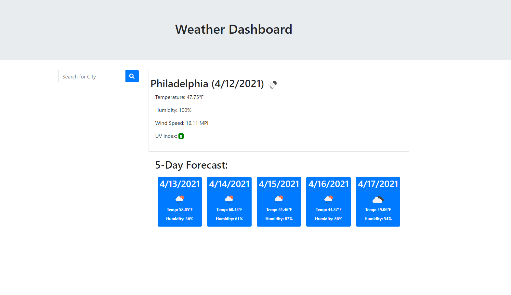
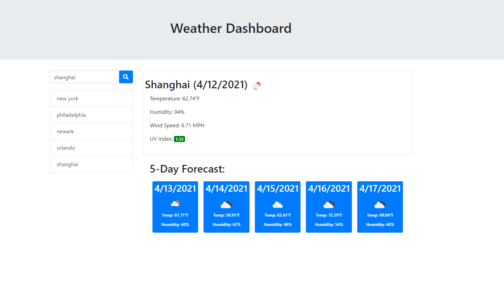

# Weather Dashboard

## Description

This weather dashboard uses the OpenWeatherMap API. When the user searches a city’s weather. It will display detailed weather conditions for the current day and next 5 days. All search history will be saved for quick access. 

## Features
* Display current and future weather for searched city.
* All search history saved, click search history will display city's weather.
* UV index is color-coded.
* 5 days forecast.

## Credit
* [jQuery](https://jquery.com/)

* [Bootstrap](https://getbootstrap.com/)
  
* [openweathermap API](https://openweathermap.org/)

## Screenshots

* Default page with philadelpha weather

* Display search history

## Links
* [Weather Dashboard github page](https://github.com/realzzkevin/Weather-Dashboard-ZZ)
  
* [Weather Dashoard page](https://realzzkevin.github.io/Weather-Dashboard-ZZ/)
